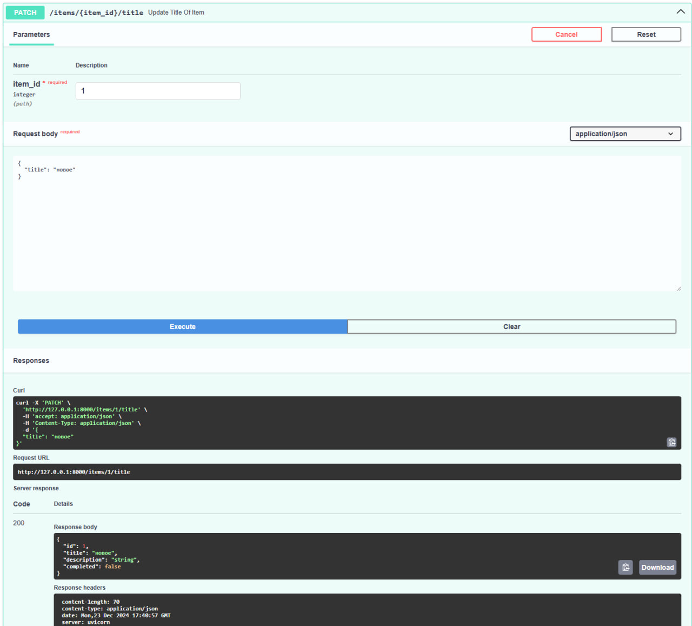

# Приложение todo app

[](https://fastapi.tiangolo.com/)
[](https://www.python.org/)

Сервис для записи запланированных дел

## Запуск

- Склонировать репозиторий
- В корне проекта ```docker compose up```

## Пример работы дополнительной ручки:

